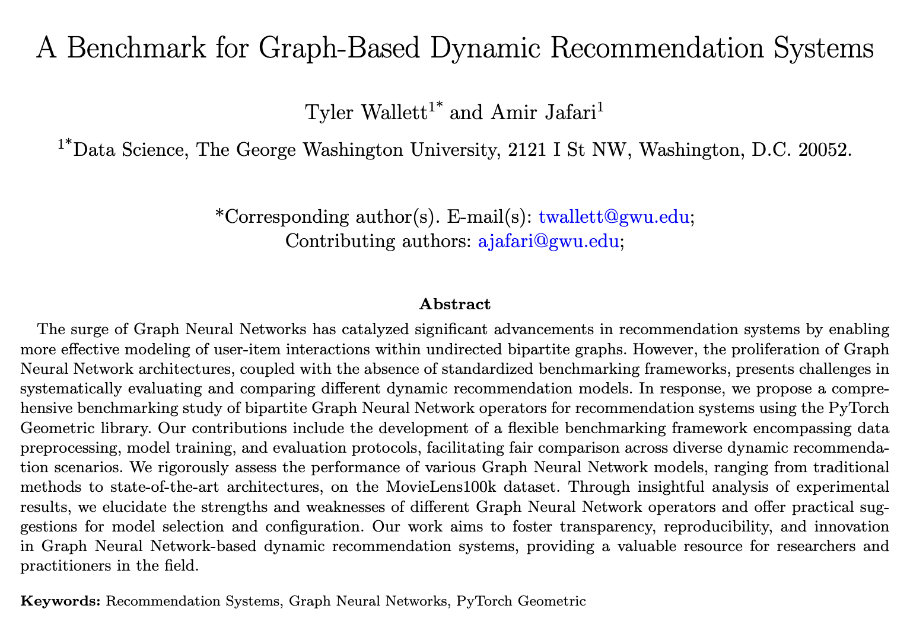
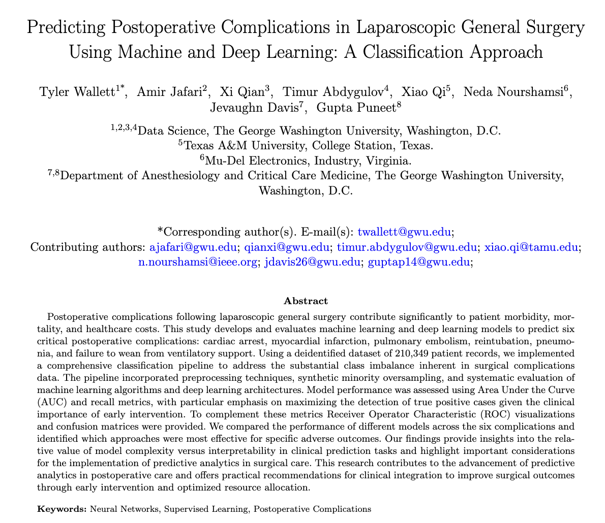
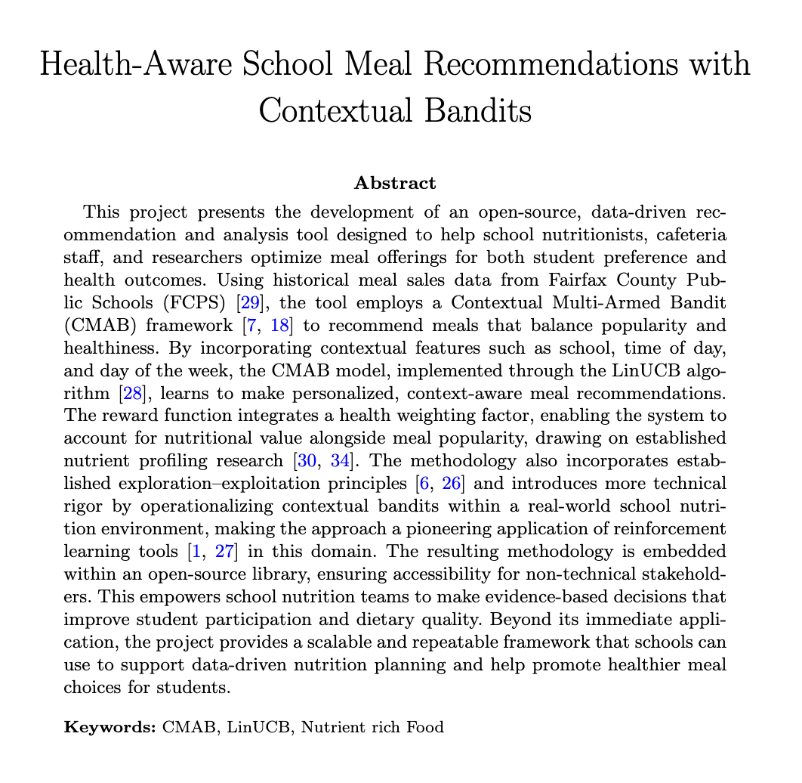
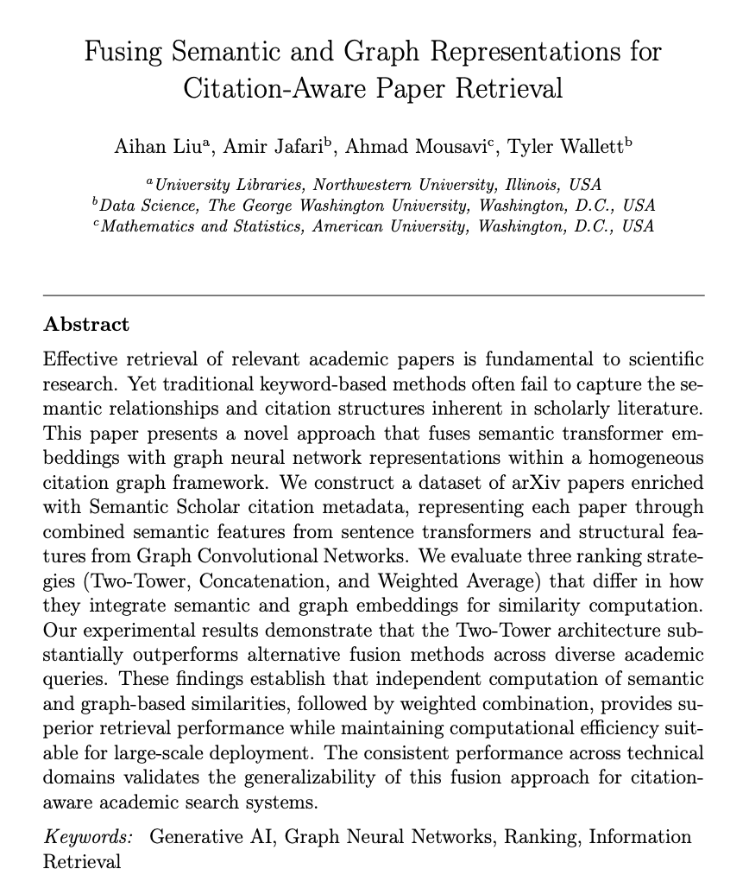

## Folder Structure

```bash
.
├── 2024
│   └── dynamic-recommender-gnn # Springer Nature
├── 2025
│   └── postoperative-prediction-ml # Springer Nature
├── 2026 # Under Review
│   ├── fcps-recommendations-cmab # Springer Nature
│   └── fusing-embeddings-llm-gnn # Association for Computing Machinery (ACM)
├── .gitignore
├── LICENSE
└── README.md
```

## <u> Research </u>

This repository contains various research projects and papers. Each project is organized into its own directory, with the year of publication as the top-level directory.

### 2024

#### A Benchmark for Graph-based Dynamic Recommendation Systems

<table>
  <tr>
    <td style="width: 200%;">
      
    </td>
  </tr>
</table>

```bibtex
@article{wallett2024benchmark,
  author    = {Wallett, Tyler and Jafari, Amir},
  title     = {A benchmark for graph-based dynamic recommendation systems},
  journal   = {Neural Computing and Applications},
  year      = {2024},
  publisher = {Springer},
  doi       = {10.1007/s00521-024-10425-6},
  url       = {https://doi.org/10.1007/s00521-024-10425-6}
}
```

### 2025

#### Predicting Postoperative Complications in Laparoscopic General Surgery Using Machine and Deep Learning: A Classification Approach

<table>
  <tr>
    <td style="width: 100%;">
      
    </td>
  </tr>
</table>

```bibtex
@article{Wallett2026,
  author = {Wallett, Tyler and Jafari, Amir and Qian, Xi and Abdygulov, Timur and Qi, Xiao and Nourshamsi, Neda and Davis, Jevaughn and Puneet, Gupta},
  title = {Predicting postoperative complications in laparoscopic general surgery using machine and deep learning: a classification approach},
  journal = {Neural Computing and Applications},
  year = {2026},
  volume = {38},
  number = {1},
  pages = {4},
  doi = {10.1007/s00521-025-11813-2},
  url = {https://doi.org/10.1007/s00521-025-11813-2},
  issn = {1433-3058}
}
```

## Expected 2026

#### Health-Aware School Meal Recommendations with Contextual Bandits

<table>
  <tr>
    <td style="width: 100%;">
      
    </td>
  </tr>
</table>

```bibtex
Under Review.
```

#### Fusing Semantic and Graph Representations for Citation-Aware Paper Retrieval

<table>
  <tr>
    <td style="width: 100%;">
      
    </td>
  </tr>
</table>

```bibtex
Under Review.
```

## Usage

Each subdirectory contains its own set of implementations and explanatory notes. To explore the implementations and learn more about each concept, navigate to the respective subdirectory's `README.md` file.

Feel free to explore, experiment, and contribute to this open source project.
